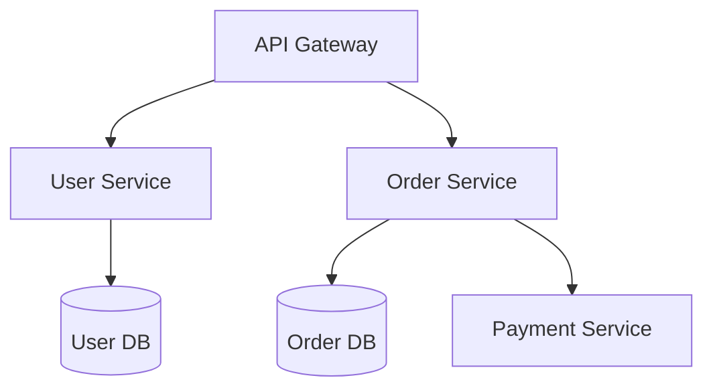

# Update Codemaps Command

## Purpose

Scan the project structure and generate concise, token-efficient architecture
documentation. Codemaps provide a high-level view of the codebase that fits
within context windows, enabling faster onboarding and navigation.

## When to Use

- After significant structural changes (new modules, renamed packages)
- When onboarding to a new project
- After a major refactoring effort
- Periodically (weekly or per sprint) to keep maps current
- When context window is filling up and you need efficient project overview

## Workflow

### Step 1: Scan Project Structure

- Walk the directory tree, ignoring build output and generated files
- Identify modules (Gradle subprojects, Maven modules)
- Catalog packages and their primary purpose
- Identify entry points (main functions, controllers, event handlers)
- Map dependency relationships between modules

### Step 2: Generate Codemaps

Create the following map files in `.claude/codemaps/` (or project-configured location):

#### architecture.md

- High-level system architecture
- Module responsibilities and boundaries
- External service integrations
- Mermaid diagram of module relationships

#### api.md

- All public API endpoints with HTTP methods
- Request/response types (references, not full schemas)
- Authentication requirements per endpoint
- Endpoint grouping by domain

#### modules.md

- Per-module summary: purpose, key classes, dependencies
- Module dependency graph (Mermaid)
- Lines of code and test coverage per module

#### data.md

- Entity/table relationships
- Database schema overview
- Key data flows through the system
- Mermaid ER diagram

#### dependencies.md

- External dependency list with versions
- Purpose of each dependency
- Dependency tree visualization
- Flagged outdated or vulnerable dependencies

### Step 3: Detect Changes

- Compare new codemaps against existing ones
- Calculate diff percentage
- If changes exceed 30%, prompt user for approval before overwriting
- Highlight what changed and why

### Step 4: Write and Verify

- Write codemap files
- Verify Mermaid diagrams render correctly
- Ensure total token count is within budget (aim for <2000 tokens per map)

## Output Format

```
## Codemap Update Report

### Maps Generated
| Map | Status | Tokens | Change % |
|-----|--------|--------|----------|
| architecture.md | UPDATED | 850 | 12% |
| api.md | UPDATED | 620 | 45% (!) |
| modules.md | NEW | 1200 | — |
| data.md | UNCHANGED | 430 | 0% |
| dependencies.md | UPDATED | 380 | 8% |

### Significant Changes
- api.md: 3 new endpoints added in user module
- modules.md: New "notifications" module detected

### Approval Required
- api.md changed by 45% — confirm overwrite? [Y/n]
```

## Codemap Format Guidelines

- Use bullet points over paragraphs
- Reference file paths, not code snippets
- Use Mermaid for all diagrams
- Keep each map under 2000 tokens
- Include last-updated timestamp at the top of each map
- Use relative paths from project root

## Example Mermaid Diagram



## Rules

- NEVER include implementation details in codemaps (only structure)
- NEVER include secrets, credentials, or internal URLs
- Regenerate from source, do not manually edit codemaps
- Keep maps factual and current, not aspirational
