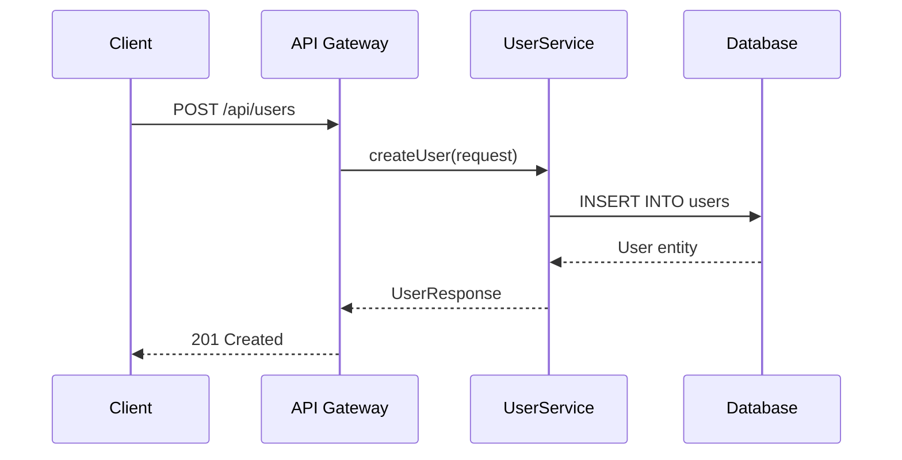
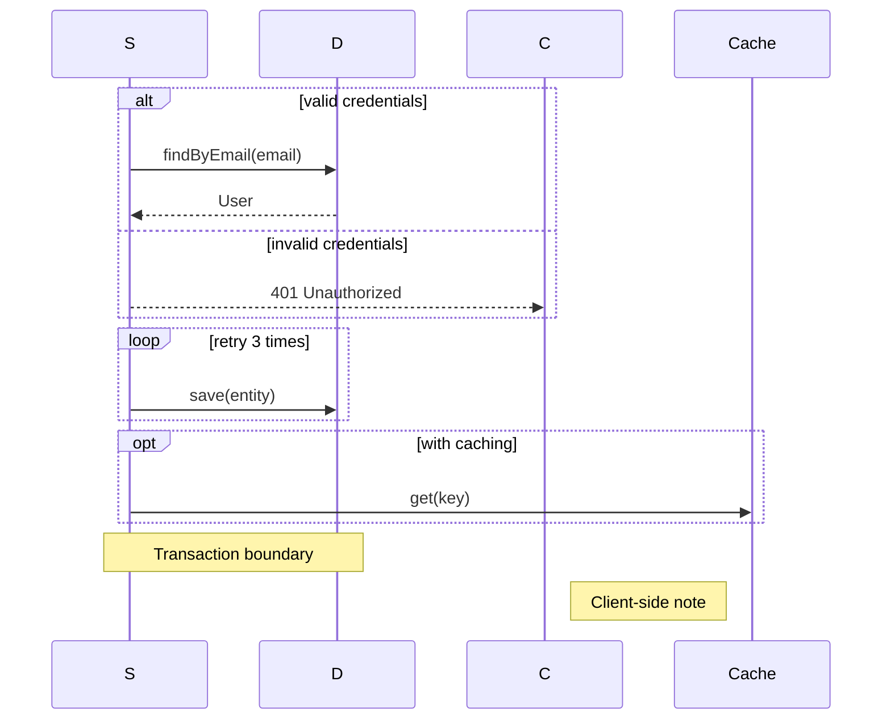
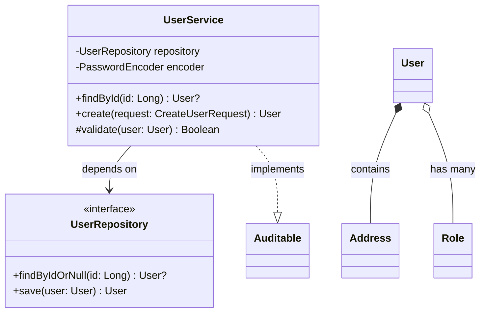
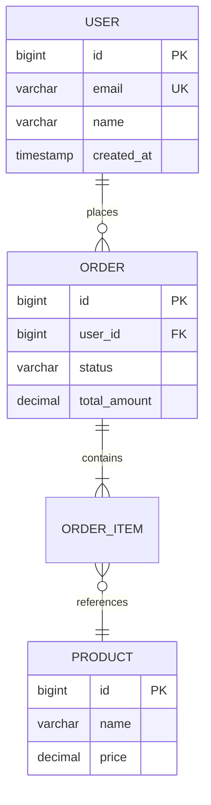
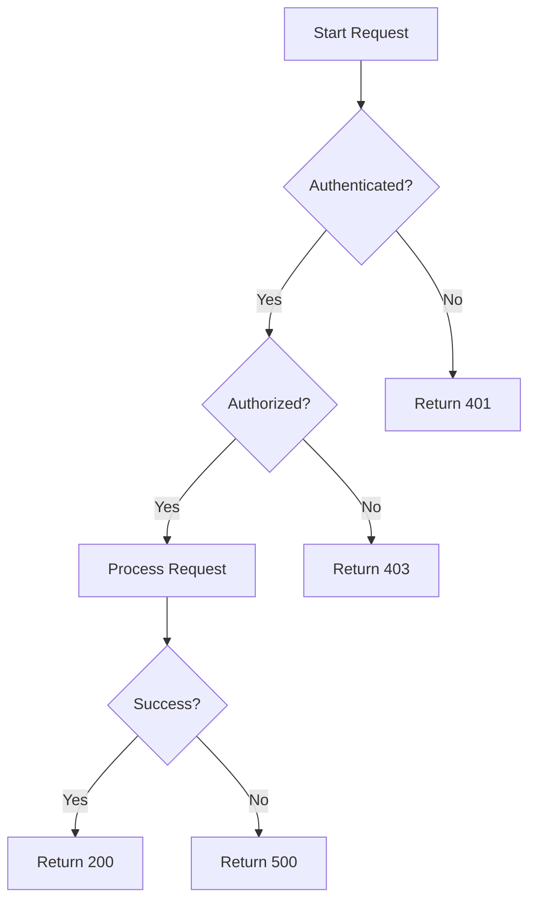
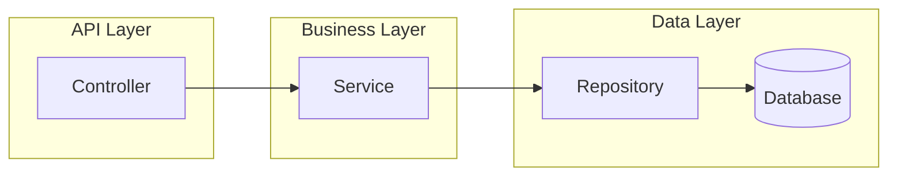
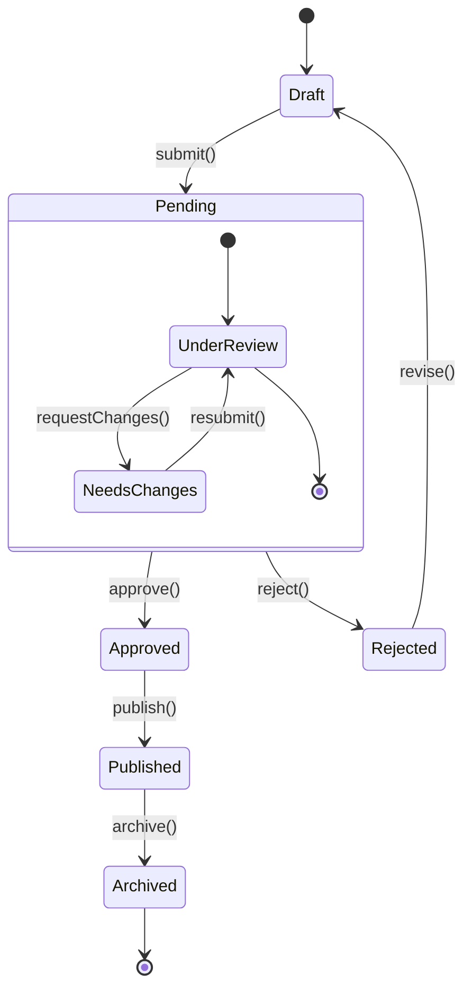
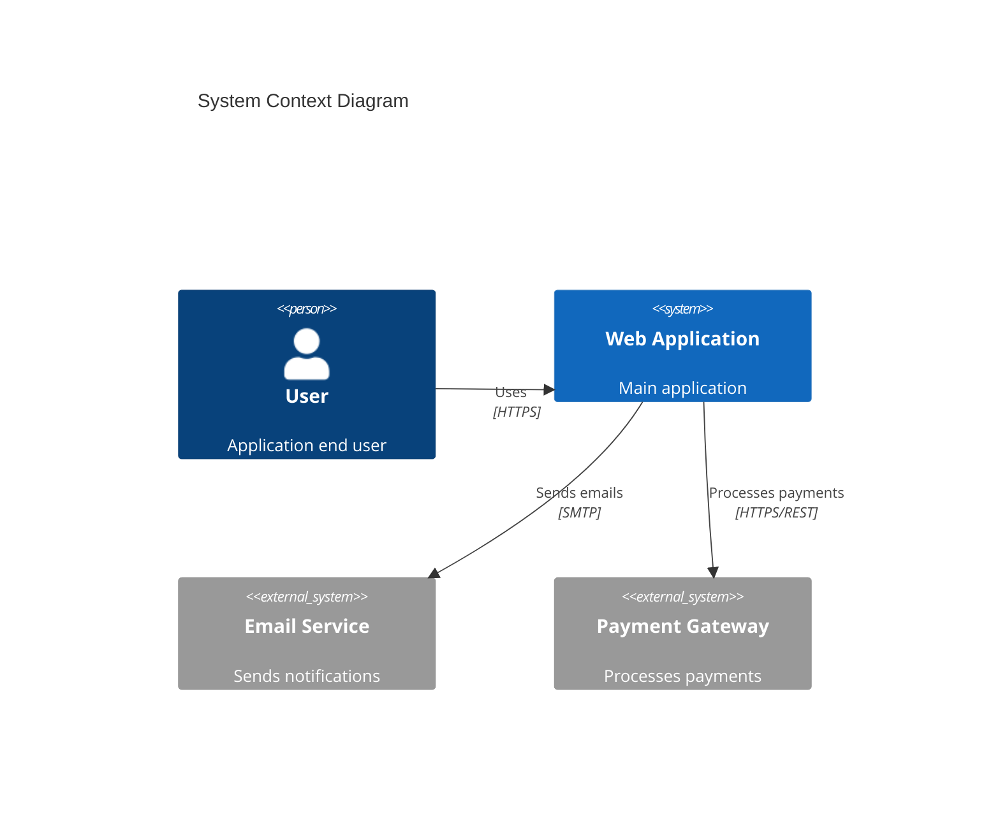
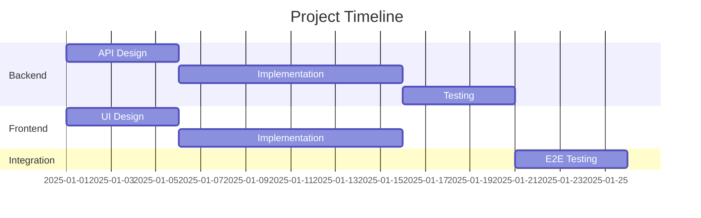

# Mermaid Diagrams

## Sequence Diagrams



Key syntax:

- `participant` — declare actors (with optional alias)
- `->>` — solid arrow (synchronous call)
- `-->>` — dashed arrow (response)
- `--)` — async message (no arrowhead)

Control flow:



## Class Diagrams



Visibility modifiers:

- `+` public
- `-` private
- `#` protected
- `~` package/internal

Relationships:

- `-->` dependency
- `..>` realization
- `*--` composition (strong ownership)
- `o--` aggregation (weak ownership)
- `<|--` inheritance

## ER Diagrams



Relationship notation:

- `||--||` one-to-one
- `||--o{` one-to-zero-or-many
- `||--|{` one-to-one-or-many
- `}o--o{` many-to-many

## Flowcharts



Node shapes:

- `[text]` — rectangle
- `(text)` — rounded rectangle
- `{text}` — diamond (decision)
- `((text))` — circle
- `>text]` — flag
- `[(text)]` — cylinder (database)

Arrow types:

- `-->` solid arrow
- `-.->` dotted arrow
- `==>` thick arrow
- `-- text -->` arrow with label

Subgraphs:



## State Diagrams



## C4 Diagrams



C4 levels:

- `C4Context` — system context (highest level)
- `C4Container` — containers within a system
- `C4Component` — components within a container

## Gantt Charts



## Best Practices

- Keep diagrams focused: max 10-15 entities per diagram
- Use meaningful labels on relationships
- Break complex diagrams into multiple smaller ones
- Use consistent naming (PascalCase for classes, camelCase for methods)
- Add titles to diagrams for context
- Use aliases for long participant names in sequence diagrams
- Group related elements with subgraphs in flowcharts

## Integration

In Markdown:

````markdown

````

In AsciiDoc (with Kroki):

```asciidoc
[mermaid]
....
flowchart TD
    A --> B
....
```

## Common Documentation Patterns

- API request flow → sequence diagram
- Domain model → class diagram
- Database schema → ER diagram
- Request processing pipeline → flowchart
- Entity lifecycle → state diagram
- System architecture → C4 diagram
- Project planning → Gantt chart
